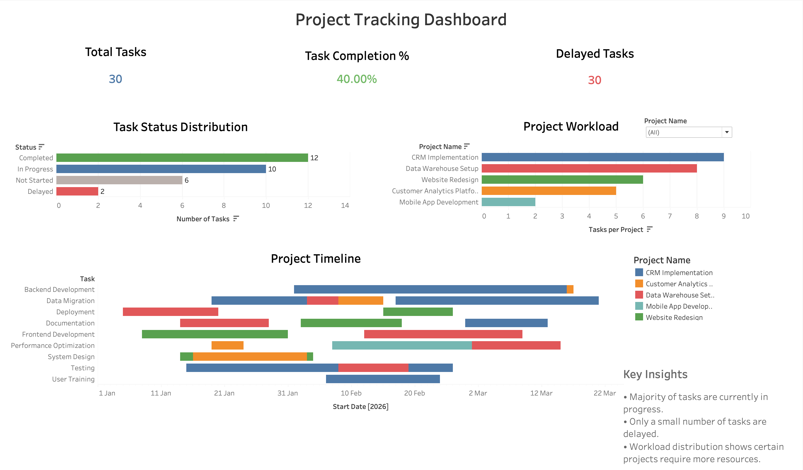

# 📊 Project Tracking Dashboard – Tableau

## Dashboard Preview

---

## 📌 Overview

This project presents an **interactive Project Tracking Dashboard built using Tableau**.  
The dashboard helps monitor project progress, track task completion status, analyze workload distribution, and visualize project timelines.

It enables project managers and stakeholders to quickly identify delayed tasks, monitor overall project performance, and manage resources more efficiently.

---

## 🎯 Business Problem

Managing multiple projects and tasks can be challenging without a centralized view of progress and deadlines. Project managers need tools to:

- Monitor task completion
- Identify delayed tasks
- Analyze workload distribution across projects
- Track project timelines effectively

This dashboard provides a **visual and interactive solution** to monitor project health and identify potential bottlenecks.

---

## 📊 Dashboard Features

### KPI Metrics
The dashboard includes key performance indicators such as:

- **Total Tasks**
- **Task Completion Rate**
- **Delayed Tasks**

These KPIs provide a quick overview of project performance.

---

### Task Status Distribution
A bar chart visualizes task distribution across different statuses:

- Completed
- In Progress
- Not Started
- Delayed

This helps identify where tasks are concentrated and detect potential delays.

---

### Project Workload Analysis
Displays the number of tasks assigned to each project, helping managers understand workload distribution and identify resource imbalance.

---

### Project Timeline (Gantt Chart)
A timeline visualization shows task durations using start and due dates, helping track project schedules and overlapping tasks.

---

### Interactive Dashboard
The dashboard supports interactive analysis through:

- **Click-to-filter interactions**
- **Project-level filtering**
- Dynamic updates across all charts

This allows users to explore project performance from multiple perspectives.

---

## 🛠 Tools & Technologies Used

- Tableau Desktop
- Data Visualization
- Dashboard Design
- Interactive Filtering
- Business Intelligence Reporting

---

## 📈 Key Insights

Some insights that can be derived from the dashboard:

- Most tasks are currently **in progress**, indicating active project execution.
- Only a small number of tasks are **delayed**, suggesting manageable project risk.
- Workload distribution shows that some projects have **higher task allocation**, which may require resource balancing.
- Timeline visualization helps identify **overlapping tasks that may affect deadlines**.

---

## 📂 Repository Files
- Dashboard_Preview.png – Dashboard screenshot
- Project_Tracking_Dashboard.twbx – Tableau packaged workbook file

---

## 🚀 How to Use

1. Download the `.twbx` file from the repository.
2. Open it using **Tableau Desktop**.
3. Interact with filters and charts to explore project performance.

---

## 👤 Author

**Nishant**  
Master’s Student – Data Analytics  
Frankfurt University of Applied Sciences

---

## 📌 Skills Demonstrated

- Data Visualization
- KPI Dashboard Development
- Business Intelligence Reporting
- Interactive Dashboard Design
- Data Storytelling

